# 🏬 Retail Data Management — ETL using AWS Glue

This project demonstrates an **end-to-end ETL pipeline** built on **AWS Glue** to integrate product and transaction data, cleanse `Sales`, compute `NetSales`, and summarize **average sales by product category and ship mode**.

---

## 📌 Project Overview

**Objective:** Join product and transaction tables, clean monetary values (remove `$`), compute net/average sales, remove duplicates and produce an aggregated result for business analysis.

**Data sources**
- `products_raw.csv` (product details)
- `transactions_raw.csv` (orders / transactions)

---

## 🏗️ Architecture Flow

<p align="center">
  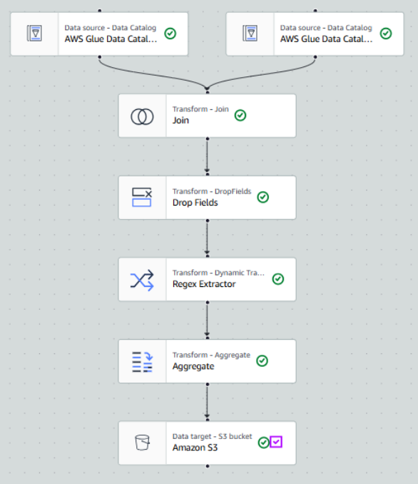
</p>

**High-level steps**
1. Files uploaded to S3 input bucket  
2. Glue Crawlers create Data Catalog tables  
3. Visual ETL job: join → drop duplicate key → regex clean Sales → aggregate → write to S3 output  
4. Validate output with S3 Select (SQL)

---

## 🪣 Step 1 — S3 Bucket & data upload

**Input bucket:** `etl-cep-00001-ashish-chamel`  
Folders: `product-files` and `transaction-files`

<p align="center">
  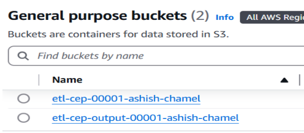<br>
  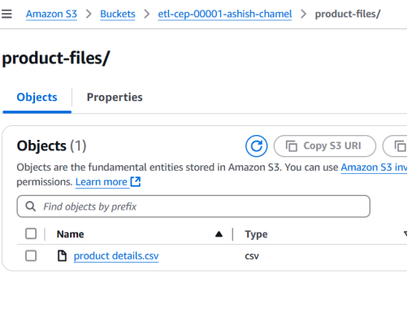
  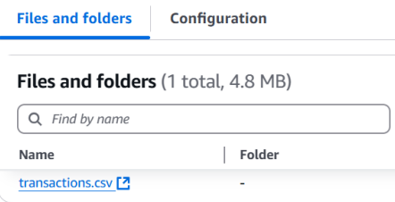
</p>

---

## 🧭 Step 2 — Glue Database & Classifiers

Created database: **`abc-retail`**.  
Created classifiers for CSV parsing.

<p align="center">
  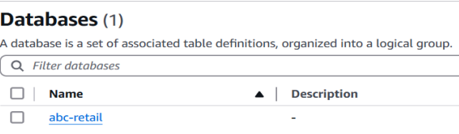<br>
  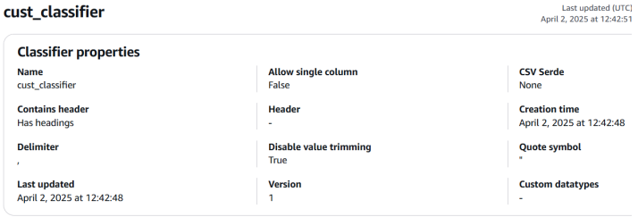
  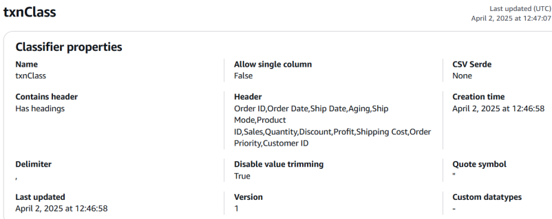
</p>

---

## 🔐 Step 3 — IAM Role

Created IAM role **`glue-role`** with `AdministratorAccess` (used for Glue to read/write S3 and create resources).

<p align="center">
  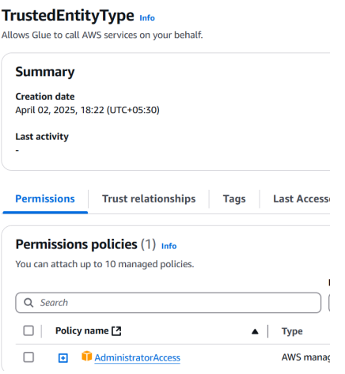
</p>

---

## 🕸️ Step 4 — Crawlers

Crawlers (`retail-crawl`, `product-crawl`) populate Glue Data Catalog tables (`txntransaction_files`, `custproduct_files`).

<p align="center">
  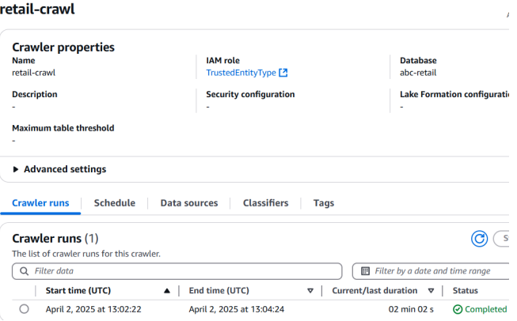
  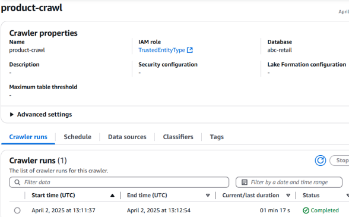
</p>

---

## ⚙️ Step 5 — Visual ETL Job

Visual ETL flow (Glue Studio):  
- **Join** on `ProductID` (inner join)  
- **DropFields** → remove duplicate `product id`  
- **Regex Extractor** → extract digits from `$` values (`\d+`) → `NetSales`  
- **Aggregate** → group by `product category`, `ship mode`, aggregate avg(Sales)  
- **Target** → S3 output bucket `etl-cep-output-00001-ashish-chamel`

<p align="center">
  
</p>

---

## ✅ Step 6 — Job execution & verification

Job name: `etl-cep-job-ashish` — executed successfully; final result verified using S3 SQL Query (S3 Select).

<p align="center">
  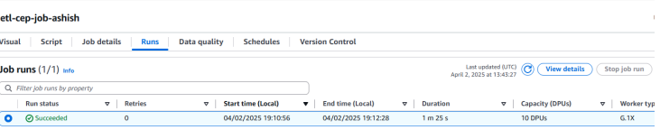<br>
  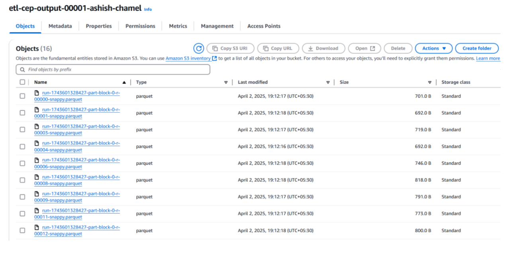<br>
  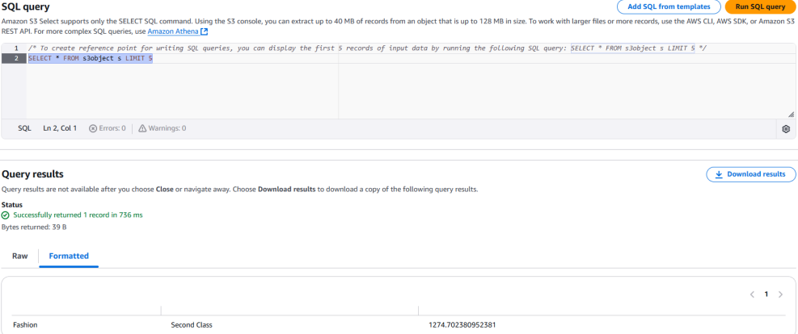
</p>

---

## 📈 Key result (example snapshot)

| Product Category | Ship Mode | Average Sales |
|------------------|-----------|----------------|
| Fashion          | Second Class | 1274.70 |

*(see `docs/report/ETL_Project1_Report.pdf` for full tables & screenshots)*

---

## 🧾 Files in this repository

```

aws-glue-retail-data-management/
├── README.md                  
├── LICENSE         
├── data/
│   ├── raw/
│   │   ├── products_raw.csv     
│   │   └── transactions_raw.csv 
│   └── processed/
│       ├── etl_output_sample.csv   
│       └── README_placeholder.txt
├── docs/
│   ├── images/
│   │   ├── s3-buckets.png
│   │   ├── s3-input-product.png
│   │   ├── s3-input-transactions.png
│   │   ├── glue-database.png
│   │   ├── cust-glue-classifiers.png
│   │   ├── txn-glue-classifiers.png
│   │   ├── iam-role.png
│   │   ├── retail-glue-crawlers.png
│   │   ├── product-glue-crawlers.png
│   │   ├── etl-job-visual.png
│   │   ├── etl-job-run-success.png
│   │   ├── s3-output-bucket.png
│   │   └── sql-query-result.png
│   └── report/
│       ├── ETL_Project1_Report.pdf 
│       └── Simplilearn_Project_Guidelines.pdf
└── src/
    └── README_placeholder.txt

```
